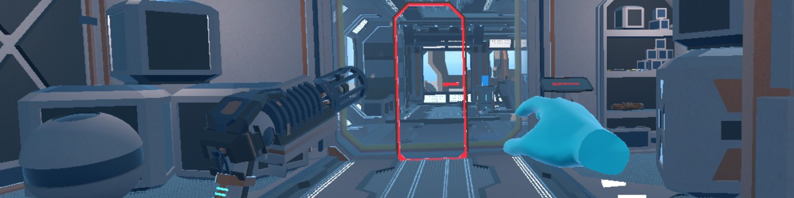

# #0x0B Unity VR Room

This project is a prototype virtual reality escape room that I used to get my feet wet in VR development in Unity, where
the player starts in a sci-fi colony building constructed with [Karboosx's Sci-Fi Styled Modular Pack](https://assetstore.unity.com/packages/3d/environments/sci-fi/sci-fi-styled-modular-pack-82913) and must solve puzzles to activate the star projector.

I utilized OpenXR and Unity's XR Interaction Toolkit for a simple but functional player controller, the left hand is a teleport gun used to move while the right floating hand interacts with objects.
I had a lot of fun learning the essentials of VR development in this project.
